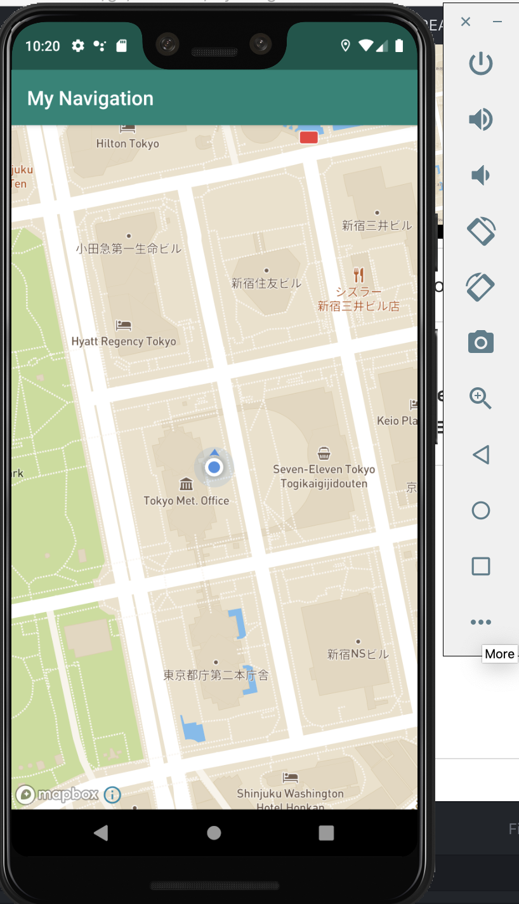

# Mapbox Navigation Demo

## はじめに

動作環境

- Android Studio:  
Android Studio 3.5.3
Build #AI-191.8026.42.35.6010548, built on November 15, 2019
JRE: 1.8.0_202-release-1483-b49-5587405 x86_64
JVM: OpenJDK 64-Bit Server VM by JetBrains s.r.o
macOS 10.14.6

- AVD:  
Pixel 3 XL API 28
1440x 2960: 560dpi
Android 9.0

- Complied version:  
compileSdkVersion: 29  
buildToolsVersion: "29.0.2"  
mapbox-android-navigation: 0.42.5  
mapbox-android-navigation-ui: 0.42.5  

## 動作イメージ

| 起動時 |経路データ読み込み|ルート表示|ナビの開始|
|-|-|-|-|
|||||
||


- (option)　Android Studio AVDにて、事前に位置情報を指定する

|AVD Managerのエミュレータで、オプションを選択|Locationを選択、Single Pointタブにて、場所を入力|Save Pointで保存|
|-|-|-|
||||


## 参考

[Navigation Map Route](https://docs.mapbox.com/android/navigation/examples/navigation-map-route)

上記サンプルの修正版は`step0`ブランチのREADME.mdを参照

## セットアップ

### 0. 事前準備

- 環境変数の設定

`MAPBOX_ACCESS_TOKEN`を環境変数として渡し、`build.gradle`と`AndroidManifest.xml`への編集を行なっている
その後、メインコードにて、以下のように呼び出している
```
        // 環境変数から、TOKENを取得
        try {
            appInfo = getPackageManager().getApplicationInfo(getPackageName(), PackageManager.GET_META_DATA);
        } catch (PackageManager.NameNotFoundException e) {
            e.printStackTrace();
        }

        String apiKey = appInfo.metaData.getString("MAPBOX_ACCESS_TOKEN");

        Mapbox.getInstance(this, apiKey);

```

res/values/strings.xmlに設定するのであれば、以下のように設定し、

```
<string name="access_token"></string>

```

メインコードのonCreate()メソッドにて以下を呼び出す

```
        Mapbox.getInstance(this, getString(R.string.access_token));
```

### 経由地の設定

- `DirectionsCriteria.PROFILE_DRIVING_TRAFFIC`については、経由地を一つしか選べない
- `DirectionsCriteria.PROFILE_DRIVING`については、最大23箇所(始点と終点合わせて25箇所）まで指定可能

```
// for launcher
private String getRouteProfileFromSharedPreferences() {
    SharedPreferences sharedPreferences = PreferenceManager.getDefaultSharedPreferences(this);
    return sharedPreferences.getString(
            getString(R.string.route_profile_key), DirectionsCriteria.PROFILE_DRIVING
    );
}
```

### Layout

```
<?xml version="1.0" encoding="utf-8"?>

<androidx.coordinatorlayout.widget.CoordinatorLayout
    xmlns:android="http://schemas.android.com/apk/res/android"
    xmlns:app="http://schemas.android.com/apk/res-auto"
    xmlns:tools="http://schemas.android.com/tools"
    android:layout_width="match_parent"
    android:layout_height="match_parent"
    tools:context=".navigationui.NavigationMapRouteActivity">


    <com.mapbox.mapboxsdk.maps.MapView
        android:id="@+id/mapView"
        android:layout_width="match_parent"
        android:layout_height="match_parent"
        app:layout_constraintBottom_toBottomOf="parent"
        app:layout_constraintHorizontal_bias="0.0"
        app:layout_constraintLeft_toLeftOf="parent"
        app:layout_constraintRight_toRightOf="parent"
        app:layout_constraintTop_toTopOf="parent"
        app:layout_constraintVertical_bias="1.0"
        app:mapbox_cameraZoomMin="11"
        app:mapbox_cameraTilt="55.8873"
        app:mapbox_cameraZoom="12.692151"
        />

<!--    for launcher-->

    <FrameLayout
        android:layout_width="wrap_content"
        android:layout_height="wrap_content"
        android:clipToPadding="false"
        android:layout_marginBottom="16dp">

        <com.google.android.material.floatingactionbutton.FloatingActionButton

            android:id="@+id/fabRemoveRoute"
            android:layout_width="wrap_content"
            android:layout_height="wrap_content"
            android:visibility="invisible"
            app:backgroundTint="@color/colorRed"
            app:srcCompat="@drawable/ic_cancel"
            tools:ignore="VectorDrawableCompat" />

    </FrameLayout>

<!--    for launcher-->
    <FrameLayout
        android:id="@+id/launch_btn_frame"
        android:layout_width="wrap_content"
        android:layout_height="wrap_content"
        app:layout_constraintEnd_toEndOf="parent"
        app:layout_constraintTop_toTopOf="parent"
        app:layout_constraintStart_toStartOf="parent"
        android:layout_margin="8dp"
        android:padding="8dp"
        android:background="@drawable/demo_switch_background"
        android:elevation="2dp"
        android:layout_gravity="center_horizontal|top">

        <Button
            android:id="@+id/launch_route_btn"
            android:layout_width="wrap_content"
            android:layout_height="wrap_content"
            android:layout_gravity="center"
            android:enabled="false"
            android:text="@string/launcher_title"/>

    </FrameLayout>

</androidx.coordinatorlayout.widget.CoordinatorLayout>
```

### 2. `values/string.xml`

```
<resources>
    <string name="app_name">Mapbox Navigation Sample</string>
    <string name="style_uri">mapbox://styles/tichimura/ck75kij6e2v4x1ip3a2v2eokf/draft</string>
    <string name="user_location_permission_explanation">This app needs location permissions in order to show its functionality.</string>
    <string name="user_location_permission_not_granted">You didn\'t grant location permissions.</string>

    <string name="settings">Settings</string>

    <string name="simulate_route_key" translatable="false">simulate_route</string>
    <string name="route_profile_key" translatable="false">route_profile</string>
    <string name="default_route_profile">driving-traffic</string>

    <string name="error_route_not_available">Current route is not available</string>

    <string name="hint_where_to">Where to?</string>
    <string name="autocompleteBehavior" translatable="false">com.mapbox.services.android.navigation.testapp.example.ui.autocomplete.AutocompleteBottomSheetBehavior</string>

    <string name="launcher_title">ナビ開始</string>
</resources>
```

### 6. `bundle.gradle(app)` を変更


```

apply plugin: 'com.android.application'

android {
    compileSdkVersion 29
    buildToolsVersion "29.0.2"

    compileOptions {
        sourceCompatibility JavaVersion.VERSION_1_8
        targetCompatibility JavaVersion.VERSION_1_8
    }

    defaultConfig {
        applicationId "com.example.mynavigation"
        minSdkVersion 15
        targetSdkVersion 29
        versionCode 1
        versionName "1.0"
        multiDexEnabled true
        testInstrumentationRunner "androidx.test.runner.AndroidJUnitRunner"
        manifestPlaceholders = [MAPBOX_ACCESS_TOKEN: System.getenv("MAPBOX_ACCESS_TOKEN")] // mapbox tokenの追加

    }
    buildTypes {
        release {
            minifyEnabled false
            proguardFiles getDefaultProguardFile('proguard-android-optimize.txt'), 'proguard-rules.pro'
        }
    }
}


dependencies {
    implementation fileTree(dir: 'libs', include: ['*.jar'])
    implementation 'androidx.appcompat:appcompat:1.1.0'
    implementation 'androidx.constraintlayout:constraintlayout:1.1.3'
    testImplementation 'junit:junit:4.12'

// for butterknife-dependencies
    androidTestImplementation 'androidx.test.ext:junit:1.1.1'
    androidTestImplementation 'androidx.test.espresso:espresso-core:3.2.0'

//    for Navigation SDK
    implementation 'com.mapbox.mapboxsdk:mapbox-android-navigation:0.42.5'
    implementation 'com.mapbox.mapboxsdk:mapbox-android-navigation-ui:0.42.5'

    implementation 'com.jakewharton:butterknife:10.2.1'
    annotationProcessor 'com.jakewharton:butterknife-compiler:10.2.1'

    implementation 'androidx.multidex:multidex:2.0.0'

}


```

### 9. `AndroidManifest.xml`の変更

Navigation SDK用の設定、また、PermissionManagerの設定を追加

```
<?xml version="1.0" encoding="utf-8"?>
<manifest xmlns:android="http://schemas.android.com/apk/res/android"
    package="com.example.mynavigation">

    <uses-permission android:name="android.permission.ACCESS_NETWORK_STATE" />
    <uses-permission android:name="android.permission.ACCESS_COARSE_LOCATION" />
    <uses-permission android:name="android.permission.ACCESS_FINE_LOCATION" />
    <uses-permission android:name="android.permission.ACCESS_LOCATION_EXTRA_COMMANDS" />
    <uses-permission android:name="android.permission.INTERNET" />
    <uses-permission android:name="android.permission.VIBRATE" />


    <application
        android:allowBackup="true"
        android:icon="@mipmap/ic_launcher"
        android:label="@string/app_name"
        android:roundIcon="@mipmap/ic_launcher_round"
        android:supportsRtl="true"
        android:theme="@style/AppTheme">
        <activity android:name=".navigationui.NavigationMapRouteActivity">
            <intent-filter>
                <action android:name="android.intent.action.MAIN" />

                <category android:name="android.intent.category.LAUNCHER" />
            </intent-filter>
        </activity>
<!--        環境変数としてトークン設定時　-->
        <meta-data android:name="MAPBOX_ACCESS_TOKEN" android:value="${MAPBOX_ACCESS_TOKEN}" />

    </application>


</manifest>
```
