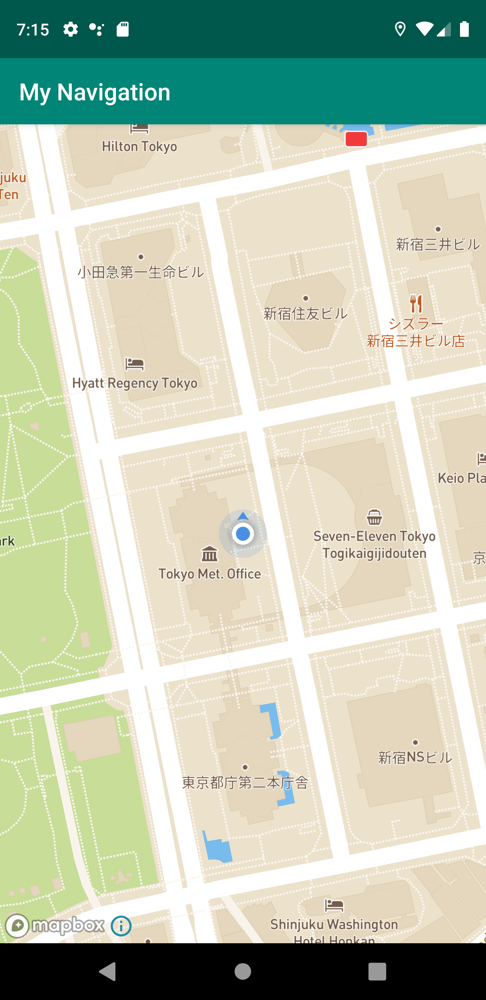
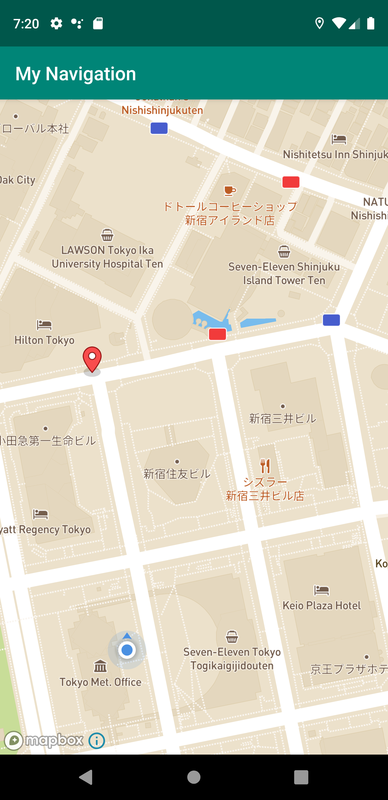
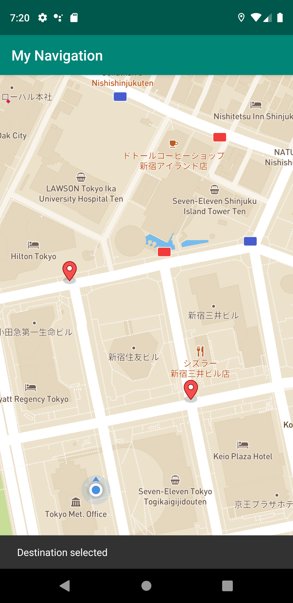
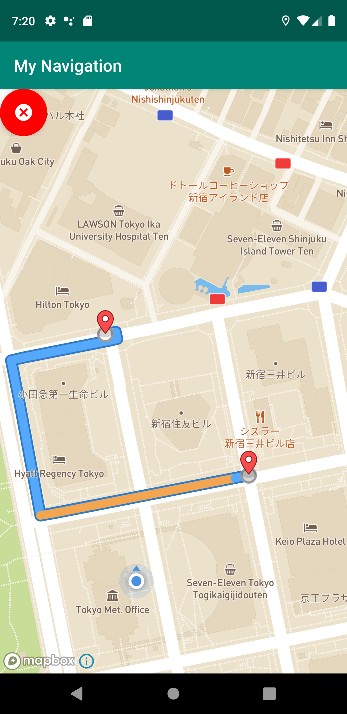

# Navigation Demo

## はじめに

ナビゲーションdemo

- Android Studio:  
Android Studio 3.5.3
Build #AI-191.8026.42.35.6010548, built on November 15, 2019
JRE: 1.8.0_202-release-1483-b49-5587405 x86_64
JVM: OpenJDK 64-Bit Server VM by JetBrains s.r.o
macOS 10.14.6

- AVD:  
Pixel 3 XL API 28
1440x 2960: 560dpi
Android 9.0

## 動作イメージ

| 起動時 |開始点を(長めに)クリック|終点を（長めに)クリック|ルートの表示|
|-|-|-|-|
||||
|

-

## 参考

[Navigation Map Route](https://docs.mapbox.com/android/navigation/examples/navigation-map-route)

## セットアップ

### 1. `layout/activity_navigation_map_route.xml`での変更


- androidxを利用するように変更

```
<android.support.design.widget.CoordinatorLayout
</android.support.design.widget.CoordinatorLayout>

```

```
<androidx.coordinatorlayout.widget.CoordinatorLayout
</androidx.coordinatorlayout.widget.CoordinatorLayout>
```


- 都庁付近をプロット(Lat:Lng = 35.693473:139.692946, Zoom=16)

```
<com.mapbox.mapboxsdk.maps.MapView
    android:id="@+id/mapView"
    android:layout_width="match_parent"
    android:layout_height="match_parent"
    app:mapbox_cameraTargetLat="35.693473"
    app:mapbox_cameraTargetLng="139.692946"
    app:mapbox_cameraZoom="16"/>
```

- ProgressBarに、app:layout_を追加

```
<ProgressBar
    android:id="@+id/routeLoadingProgressBar"
    android:layout_width="wrap_content"
    android:layout_height="wrap_content"
    app:layout_constraintTop_toTopOf="parent"
    app:layout_constraintEnd_toEndOf="parent"
    app:layout_constraintStart_toStartOf="parent"
    app:layout_constraintBottom_toBottomOf="parent"
    android:visibility="invisible"/>
```

- FrameLayoutを、以下に変更

```
<FrameLayout
    android:layout_width="wrap_content"
    android:layout_height="wrap_content"
    android:clipToPadding="false"
    android:layout_marginBottom="16dp">

    <com.google.android.material.floatingactionbutton.FloatingActionButton

        android:id="@+id/fabRemoveRoute"
        android:layout_width="wrap_content"
        android:layout_height="wrap_content"
        android:visibility="invisible"
        app:backgroundTint="@color/colorRed"
        app:srcCompat="@drawable/ic_cancel"
        tools:ignore="VectorDrawableCompat" />

</FrameLayout>

```

なお、FloatingActionButtonのパッケージも以下のように変更しているので注意

```
       <android.support.design.widget.FloatingActionButton
```


```
      <com.google.android.material.floatingactionbutton.FloatingActionButton
```

また、

```
app:backgroundTint="@color/red"
```
を
```
app:backgroundTint="@color/colorRed"
```
としている.


```

### 2. `values/string.xml`での変更点

- `access_token`に、自身のToken、`style_uri`に、style uriを指定する

```
    <string name="access_token">YOUR_ACCESS_TOKEN</string>
    <string name="style_uri">mapbox://YOUR_STYLE</string>    
```


- `user_location_permission_explanation`と`user_location_permission_not_granted`を追加（後述: 位置情報取得のためのPermissionManagerを利用する際の確認のため）

```
    <string name="user_location_permission_explanation">This app needs location permissions in order to show its functionality.</string>
    <string name="user_location_permission_not_granted">You didn\'t grant location permissions.</string>
</resources>
```

### 3. `values/colors.xml`での変更点

- 以下を追加
```
<color name="colorRed">#FF0000</color>
```

### 4. `drawable/ic_cancel.xml`を追加

```
<vector android:height="24dp" android:tint="#FFFFFF"
    android:viewportHeight="24.0" android:viewportWidth="24.0"
    android:width="24dp" xmlns:android="http://schemas.android.com/apk/res/android">
    <path android:fillColor="#FF000000" android:pathData="M12,2C6.47,2 2,6.47 2,12s4.47,10 10,10 10,-4.47 10,-10S17.53,2 12,2zM17,15.59L15.59,17 12,13.41 8.41,17 7,15.59 10.59,12 7,8.41 8.41,7 12,10.59 15.59,7 17,8.41 13.41,12 17,15.59z"/>
</vector>
```


### 5. `drawable/ic_layer.xml`を追加（オプション）

実質使ってないので、こちらは不要だが、一応記述

```
<vector xmlns:android="http://schemas.android.com/apk/res/android"
    android:width="24dp"
    android:height="24dp"
    android:viewportWidth="24.0"
    android:viewportHeight="24.0">
    <path
        android:fillColor="#FFFFFF"
        android:pathData="M11.99,18.54l-7.37,-5.73L3,14.07l9,7 9,-7 -1.63,-1.27 -7.38,5.74zM12,16l7.36,-5.73L21,9l-9,-7 -9,7 1.63,1.27L12,16z"/>
</vector>
```

### 6. `bundle.gradle`(app)を変更


```

apply plugin: 'com.android.application'

android {
    compileSdkVersion 29
    buildToolsVersion "29.0.2"

    compileOptions {
        sourceCompatibility JavaVersion.VERSION_1_8
        targetCompatibility JavaVersion.VERSION_1_8
    }

    defaultConfig {
        applicationId "com.example.mynavigation"
        minSdkVersion 15
        targetSdkVersion 29
        versionCode 1
        versionName "1.0"
        multiDexEnabled true
        testInstrumentationRunner "androidx.test.runner.AndroidJUnitRunner"
    }
    buildTypes {
        release {
            minifyEnabled false
            proguardFiles getDefaultProguardFile('proguard-android-optimize.txt'), 'proguard-rules.pro'
        }
    }
}


dependencies {
    implementation fileTree(dir: 'libs', include: ['*.jar'])
    implementation 'androidx.appcompat:appcompat:1.1.0'
    implementation 'androidx.constraintlayout:constraintlayout:1.1.3'
    testImplementation 'junit:junit:4.12'

    // for butterknife-dependencies
    androidTestImplementation 'androidx.test.ext:junit:1.1.1'
    androidTestImplementation 'androidx.test.espresso:espresso-core:3.2.0'

    implementation 'com.mapbox.mapboxsdk:mapbox-android-navigation:0.42.4'
    implementation 'com.mapbox.mapboxsdk:mapbox-android-navigation-ui:0.42.4'

    implementation 'com.jakewharton:butterknife:10.2.1'
    annotationProcessor 'com.jakewharton:butterknife-compiler:10.2.1'

    implementation 'androidx.multidex:multidex:2.0.0'

}

```

### 7. `build.gradle` (project) 参考

```
// Top-level build file where you can add configuration options common to all sub-projects/modules.

buildscript {
    repositories {
        google()
        jcenter()

    }
    dependencies {
        classpath 'com.android.tools.build:gradle:3.5.3'

        // NOTE: Do not place your application dependencies here; they belong
        // in the individual module build.gradle files
    }
}

allprojects {
    repositories {
        google()
        jcenter()
        maven { url 'https://mapbox.bintray.com/mapbox' }
    }
}

task clean(type: Delete) {
    delete rootProject.buildDir
}
```

### 8. `gradle.properties`に以下が追加されているのを確認

```
android.useAndroidX=true
android.enableJetifier=true
```

### 9. `AndroidManifest.xml`の変更

Navigation SDK用の設定、また、PermissionManagerの設定を追加

```
<?xml version="1.0" encoding="utf-8"?>
<manifest xmlns:android="http://schemas.android.com/apk/res/android"
    package="com.example.mynavigation">

    <uses-permission android:name="android.permission.ACCESS_NETWORK_STATE" />
    <uses-permission android:name="android.permission.ACCESS_COARSE_LOCATION" />
    <uses-permission android:name="android.permission.ACCESS_FINE_LOCATION" />
    <uses-permission android:name="android.permission.ACCESS_LOCATION_EXTRA_COMMANDS" />
    <uses-permission android:name="android.permission.INTERNET" />
    <uses-permission android:name="android.permission.VIBRATE" />


    <application
        android:allowBackup="true"
        android:icon="@mipmap/ic_launcher"
        android:label="@string/app_name"
        android:roundIcon="@mipmap/ic_launcher_round"
        android:supportsRtl="true"
        android:theme="@style/AppTheme">
        <activity android:name=".navigationui.NavigationMapRouteActivity">
            <intent-filter>
                <action android:name="android.intent.action.MAIN" />

                <category android:name="android.intent.category.LAUNCHER" />
            </intent-filter>
        </activity>
    </application>


</manifest>
```


### 10. メイン・コード　`NavigationMapRouteActivity.java`　

```
package com.example.mynavigation.navigationui;

import android.annotation.SuppressLint;
import android.content.Context;
import android.os.Build;
import android.os.Bundle;
import android.os.VibrationEffect;
import android.os.Vibrator;
import android.view.View;
import android.widget.ProgressBar;
import android.widget.Toast;

import androidx.annotation.NonNull;
import androidx.appcompat.app.AppCompatActivity;

import com.google.android.material.floatingactionbutton.FloatingActionButton;
import com.google.android.material.snackbar.Snackbar;
import com.mapbox.android.core.permissions.PermissionsListener;
import com.mapbox.android.core.permissions.PermissionsManager;
import com.mapbox.api.directions.v5.models.DirectionsResponse;
import com.mapbox.api.directions.v5.models.DirectionsRoute;
import com.mapbox.geojson.Point;
import com.mapbox.mapboxsdk.Mapbox;
import com.mapbox.mapboxsdk.annotations.Marker;
import com.mapbox.mapboxsdk.annotations.MarkerOptions;
import com.mapbox.mapboxsdk.geometry.LatLng;
import com.mapbox.mapboxsdk.location.LocationComponent;
import com.mapbox.mapboxsdk.location.modes.CameraMode;
import com.mapbox.mapboxsdk.location.modes.RenderMode;
import com.mapbox.mapboxsdk.maps.MapView;
import com.mapbox.mapboxsdk.maps.MapboxMap;
import com.mapbox.mapboxsdk.maps.OnMapReadyCallback;
import com.mapbox.mapboxsdk.maps.Style;
import com.example.mynavigation.R;
import com.mapbox.services.android.navigation.ui.v5.route.NavigationMapRoute;
import com.mapbox.services.android.navigation.v5.navigation.NavigationRoute;

import java.util.List;

import butterknife.BindView;
import butterknife.ButterKnife;
import butterknife.OnClick;
import retrofit2.Call;
import retrofit2.Callback;
import retrofit2.Response;
import timber.log.Timber;

public class NavigationMapRouteActivity extends AppCompatActivity implements OnMapReadyCallback, PermissionsListener,
        MapboxMap.OnMapLongClickListener, Callback<DirectionsResponse>  {

    private static final int ONE_HUNDRED_MILLISECONDS = 100;

    @BindView(R.id.mapView)
    MapView mapView;
    @BindView(R.id.routeLoadingProgressBar)
    ProgressBar routeLoading;
    @BindView(R.id.fabRemoveRoute)
    FloatingActionButton fabRemoveRoute;

    private PermissionsManager permissionsManager;
    private MapboxMap mapboxMap;
    private NavigationMapRoute navigationMapRoute;

    private Marker originMarker;
    private Marker destinationMarker;

    @Override
    protected void onCreate(Bundle savedInstanceState) {
        super.onCreate(savedInstanceState);

        Mapbox.getInstance(this, getString(R.string.access_token));

        setContentView(R.layout.activity_navigation_map_route);
        ButterKnife.bind(this);

        mapView.onCreate(savedInstanceState);
        mapView.getMapAsync(this);


    }

    @OnClick(R.id.fabRemoveRoute)
    public void onRemoveRouteClick(View fabRemoveRoute) {
        removeRouteAndMarkers();
        fabRemoveRoute.setVisibility(View.INVISIBLE);
    }

    @Override
    public void onMapReady(MapboxMap mapboxMap) {
        this.mapboxMap = mapboxMap;

        // fromUriは、自身で設定
        mapboxMap.setStyle(new Style.Builder().fromUri(getString(R.string.style_uri)), style -> {
            initializeLocationComponent(mapboxMap);
            navigationMapRoute = new NavigationMapRoute(null, mapView, mapboxMap);
            mapboxMap.addOnMapLongClickListener(this);
            Snackbar.make(mapView, "Long press to select route", Snackbar.LENGTH_SHORT).show();
        });
    }

    @Override
    public boolean onMapLongClick(@NonNull LatLng point) {
        handleClicked(point);
        return true;
    }

    @Override
    public void onResponse(@NonNull Call<DirectionsResponse> call, @NonNull Response<DirectionsResponse> response) {
        if (response.isSuccessful()
                && response.body() != null
                && !response.body().routes().isEmpty()) {
            List<DirectionsRoute> routes = response.body().routes();
            navigationMapRoute.addRoutes(routes);
            routeLoading.setVisibility(View.INVISIBLE);
            fabRemoveRoute.setVisibility(View.VISIBLE);
        }
    }

    @Override
    public void onFailure(@NonNull Call<DirectionsResponse> call, @NonNull Throwable throwable) {
        Timber.e(throwable);
    }

    @Override
    public void onResume() {
        super.onResume();
        mapView.onResume();
    }

    @Override
    protected void onStart() {
        super.onStart();
        mapView.onStart();
        if (navigationMapRoute != null) {
            navigationMapRoute.onStart();
        }
    }

    @Override
    protected void onStop() {
        super.onStop();
        mapView.onStop();
        if (navigationMapRoute != null) {
            navigationMapRoute.onStop();
        }
    }

    @Override
    public void onPause() {
        super.onPause();
        mapView.onPause();
    }

    @Override
    public void onLowMemory() {
        super.onLowMemory();
        mapView.onLowMemory();
    }

    @Override
    protected void onDestroy() {
        super.onDestroy();
        mapView.onDestroy();
    }

    @Override
    protected void onSaveInstanceState(Bundle outState) {
        super.onSaveInstanceState(outState);
        mapView.onSaveInstanceState(outState);
    }

    // 編集
    @SuppressWarnings("MissingPermission")
    private void initializeLocationComponent(MapboxMap mapboxMap) {

        if (PermissionsManager.areLocationPermissionsGranted(this)) {

        LocationComponent locationComponent = mapboxMap.getLocationComponent();
        locationComponent.activateLocationComponent(this, mapboxMap.getStyle());
        locationComponent.setLocationComponentEnabled(true);
        locationComponent.setRenderMode(RenderMode.COMPASS);
        locationComponent.setCameraMode(CameraMode.TRACKING);
        locationComponent.zoomWhileTracking(10d);
        } else {
            permissionsManager = new PermissionsManager(this);
            permissionsManager.requestLocationPermissions(this);
        }
    }


    @Override
    public void onRequestPermissionsResult(int requestCode, @NonNull String[] permissions, @NonNull int[] grantResults) {
        permissionsManager.onRequestPermissionsResult(requestCode, permissions, grantResults);
    }

    @Override
    public void onExplanationNeeded(List<String> permissionsToExplain) {
        Toast.makeText(this, R.string.user_location_permission_explanation, Toast.LENGTH_LONG).show();
    }

    @Override
    public void onPermissionResult(boolean granted) {
        if (granted) {
            mapboxMap.getStyle(new Style.OnStyleLoaded() {
                @Override
                public void onStyleLoaded(@NonNull Style style) {
                    initializeLocationComponent(mapboxMap);
                }
            });
        } else {
            Toast.makeText(this, R.string.user_location_permission_not_granted, Toast.LENGTH_LONG).show();
            finish();
        }
    }


    private void handleClicked(@NonNull LatLng point) {
        vibrate();
        if (originMarker == null) {
            originMarker = mapboxMap.addMarker(new MarkerOptions().position(point));
            Snackbar.make(mapView, "Origin selected", Snackbar.LENGTH_SHORT).show();
        } else if (destinationMarker == null) {
            destinationMarker = mapboxMap.addMarker(new MarkerOptions().position(point));
            Point originPoint = Point.fromLngLat(
                    originMarker.getPosition().getLongitude(), originMarker.getPosition().getLatitude());
            Point destinationPoint = Point.fromLngLat(
                    destinationMarker.getPosition().getLongitude(), destinationMarker.getPosition().getLatitude());
            Snackbar.make(mapView, "Destination selected", Snackbar.LENGTH_SHORT).show();
            findRoute(originPoint, destinationPoint);
            routeLoading.setVisibility(View.VISIBLE);   // 場合によってはコメントアウト
        }
    }

    @SuppressLint("MissingPermission")
    private void vibrate() {
        Vibrator vibrator = (Vibrator) getSystemService(Context.VIBRATOR_SERVICE);
        if (vibrator == null) {
            return;
        }
        if (Build.VERSION.SDK_INT >= Build.VERSION_CODES.O) {
            vibrator.vibrate(VibrationEffect.createOneShot(ONE_HUNDRED_MILLISECONDS, VibrationEffect.DEFAULT_AMPLITUDE));
        } else {
            vibrator.vibrate(ONE_HUNDRED_MILLISECONDS);
        }
    }

    private void removeRouteAndMarkers() {
        mapboxMap.removeMarker(originMarker);
        originMarker = null;
        mapboxMap.removeMarker(destinationMarker);
        destinationMarker = null;
        navigationMapRoute.removeRoute();
    }

    public void findRoute(Point origin, Point destination) {
        NavigationRoute.builder(this)
                .accessToken(Mapbox.getAccessToken())
                .origin(origin)
                .destination(destination)
                .alternatives(true)
                .build()
                .getRoute(this);
    }

}

```
